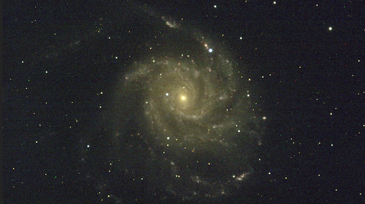

## The Cosmic Perpective
### a session for the Benghazi team May 29th, 2023
### taught for BRIEF Boyce Astro Foundation by Chandru Narayan

The Pinwheel Galaxy M101 along with the [supernova sn2023ixf](https://en.wikipedia.org/wiki/SN_2023ixf) 

### [The Cosmic Perspective]() - For the Benghazi Team May 29, 2023

The iron in our blood came from a supernova just like this several billion years ago in the solar neighbourhood. So we have a direct cosmic connection to supernovae. To capture one is like peering through a time machine that took us 21 million light years in our past and watching the birth of solar systems like ours. Another thought is that, even as we speak, neutrinos from this specific supernova by thousands are coursing planet earth and through our bodies every second. We are bathing in its showers!  A more sobering note is that any civilizations and living things within a 50 light-year radius of SN2023IXF have been wiped out in a fraction of a second.  Let’s say a prayer for all of those souls. 

Things to ponder (and some mathemeatics!):

1. [Where is this supernova](m101_sky.png) in the sky?
1. [How far away and how big](howbig.png) is the Pinwheel Galaxy
1. [What kind of supernova](https://en.wikipedia.org/wiki/SN_2023ixf) is this?
1. What happened to the host star?
1. [Color Image of scheduled observation from last week](https://observe.lco.global/requests/3233316)
1. How bright is this supernova? 
    * [Let's calculate](https://www.phys.ksu.edu/personal/wysin/astro/magnitudes.html)!
1. The cosmic connection
    * Life in the Universe
    * Neutrinos and Light
    * Death in the Universe
