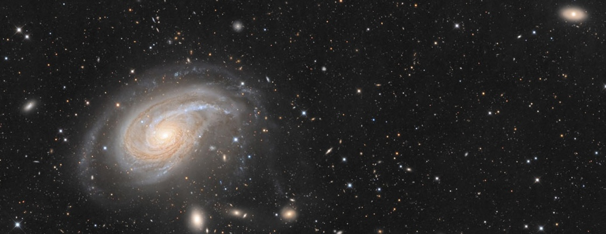

## Course repository for the ***Python for Astronomy Spring 2026*** Workshop 
#### taught for BRIEF Boyce Astro Foundation by Chandru Narayan - *updated March 4, 2026*




## Welcome to Python for Astronomy! [2026 course flyer](src/python4astro_flyer.png)

## [Slack channel for all student communications - please add hello msg with login country/time-zone](https://boyce-astro-seminars.slack.com/archives/C0AKGDN9KTL){:target="_blank"}
---
### [The Cosmic Perspective](cosmic_perspective)

### P4A NEWS - READ THIS SECTION BELOW FOR NEW UPDATES!
- **Mar 09: Slack Channel added for this seminar, see above!**
- [Mar 06: Usernames for registered students added! If you do not see your username email drunarayan@gmail.com](#click-to-see-user-names-already-available-for-the-spring-2026-class-in-our-google-virtual-machine){:target="_blank"}

## Goals for the P4A workshop
Our workshop will cover a smattering of interesting or historically significant Astronomy topics in no particular sequence.  However, the main goal of this course is to teach critical college and research skills that you will need as a student & professional. We will attempt to develop these skills primarily on Astronomy related topics as you clearly are astro enthusiasts!  The primary audience for this course are Motivated High School, College students, or Early Career professionals. The courses are mostly free of charge other than a small fee for oprational expenses. We also care about accessibility of these resources across student communities who may be underrepresented and of a diverse socio economic background. We hope to keep Telescope & Computing resources free and open for use as much as possible for those students requiring financial assistance.  Please contact me directly at <a href="mailto:drunarayan@gmail.com">drunarayan@gmail.com</a>  if you would like to learn more about this course or in need of special fee waivers.

### Advanced Maths topics with Python programming include:
1. Powers of 10, Units of measure for distance and angles
1. Independent and Dependent Variables & Functions
1. Celestial coordinates, Units & Units conversions
1. Triangles, Circles, and Ellipses
1. Trigonometry and small angle approximation
1. Exponentials and their Functions
1. Logarithms and their Functions
1. Derivation of Astronomical equations you have taken for granted

### Computing Skills we will teach include:
1. Jupyter Notebooks (the backbone of JupyterLab)
1. JupyterHub & JupyterLab (dev environment for Jupyter Notebooks adopted widely by universities)
1. Markdown Syntax (dynamic text, images, video, code, publishing
1. LaTeX (web and github enables equation editor for research)
1. Python (language of choice for data science and STEM publications)
1. Matplotlib (plotting large amounts of data)
1. Pandas, Scipy & Numpy (dataframes and math libraries for Python)
1. SQL (structured query language for querying astro databases)

We expect to run for a total of 5 sessions ***every Monday starting March 9th***. Look for a Google Meet schedule links to be available at this page ahead of the workshop start date. 

Please check this link below for ALL UPDATES.  I will try not to send emails or notifications for any updates.  All materials will show up on this link below.  So please bookmark it check it frequently. 

[Python for Astronomy Course Website](http://drunarayan.github.io/python4astronomy){:target="_blank"}  (this site)

## What is Jupyter?

If you are not familiar with [Project Jupyter](http://jupyter.org/){:target="_blank"}, [Jupyter Notebook](https://jupyter.org/try-jupyter/retro/notebooks/?path=notebooks/Intro.ipynb){:target="_blank"} [JupyterLab](https://jupyter.org/try-jupyter/retro/notebooks/?path=notebooks/Intro.ipynb){:target="_blank"} or [JupyterHub](http://jupyter.org/hub){:target="_blank"}, I highly recommend learning about them by following the embedded links.  

All of the content provided here are accessible to you using a combination of technologies provided by [Jupyter](http://jupyter.org/){:target="_blank"} and [Github](https://github.com/){:target="_blank"} where 83+ million researchers around the world come together to publish the share their work.  

You will be accessing your own 'virtual laptop' hosted on a Google virtual machine somewhere in the globe to do your work.  You class materials will be available to you there and you will store the products of your learning there and not on your physical computer from which you are accessing this course. Your work will be to modify the Jupyter Notebooks to add text, images, video, to write your own code, query and retrieve astronomical databases, analyze and plot your results graphically.

## Create your JupyterLab Login for use later!

You will be logging into JupyterHub for getting workshop materials and creating your own Jupyter Notebooks.  Your username is simply ```<your first name no spaces>.``` followed by ```<your last name no spaces>.``` followed by the word ```p4a``` you ```provided in your registration```. For instance, my username would be ```chandru.narayan.p4a```. ***The first time you log in, create and type in any password you make up yourself.***  That will become your actual password for this JupyterHub - please try not to forget it.  If you do, email me at <a href="mailto:drunarayan@gmail.com">drunarayan@gmail.com</a> , I will reset it.  Please see created usernames by clicking below. 

### [Click to see User Names already available for the Spring 2026 Class in our Google Virtual Machine](spring_2026_usernames.md){:target="_blank"}

***If your username does not show up on this list above, please email <a href="mailto:drunarayan@gmail.com">drunarayan@gmail.com</a>  with the email address you used to register for the class and the username you require in the format described above***.

## Workshop organization & JupyterLab - your own virtual laptop in the sky!

The structure of this Workshop includes specific ***Projects*** below.  These Projects provide access to multiple materials, including **your own virtual laptop**, Jupyter Notebooks, media files (images, video), presentations, PDF files, CSV files, database files and the like.  Each Project wil have its own collection of content linked below.  When you click on the very first project link below to get started!

When you do so, it will make your own initial copy to your JupyterHub account and allow you to edit and modify them.  As you modify them, ***JupyterLab*** (the IDE inside JupyterHub) will keep track of the modifications and you ***should never lose your edits***.  It is highly recommended that you ***do not change the names of the notebooks or files*** as they are being tracked and version controlled. You can always return to this page to access any specific project below where you can access your latest edits.  JupyterHub is widely used and state-of-the-art mechanism that universities use to manage Jupyter Notebooks and other course materials.  It is expected that future courses taught by me for BRIEF Programs will provide access to the same user account you are using now.

## Availability of JupyterLab Virtual Machine (Your Virtual Laptop)

***Your virtual laptops will be online and available Sunday Morning 11:00 AM to Tuesday Evening 11:00 PM Pacific Time each week*** for use in the classroom and for completing your assignments. The google VM is not available at times other than those specified below. 
* [START Sun 11:00 AM Pacific - click to convert for your time zone](https://www.inyourowntime.zone/2026-03-08_11.00_America.Los_Angeles?forget=1){:target="_blank"}
* [END Tue 11:00 PM Pacific - click to convert for your time zone](https://www.inyourowntime.zone/2026-03-10_23.00_America.Los_Angeles?forget=1){:target="_blank"}

***You will be able to login during these times and complete your assignments ahead of, during and after the web meeting sessions each week.***  At other times, the virtual machine will be taken down to reduce the cost of using the Google Cloud. If you have a special need, you can contact me and I will try and make accommodations.

## Projects & Materials Access
#### Please complete these steps including ``Project 0`` ahead of the first session
* [Access Online OpenStax Astronomy Textbook here](https://openstax.org/books/astronomy-2e/pages/1-introduction){:target="_blank"}
* Complete ```Project 0: First Login to Jupyter  - What is JupyterLab - Jupyter Notebooks - Learn Basics``` should be available for you to create your first lines of code in Python for this class.  I encourage you to click the first project below, ***login with your username and password as identified in the previous paragraphs***. See if you can complete this ahead of our first session!

## Projects Schedule

Project|Topic Description|
---|---
0|<a href="https://drunarayan.github.io/python4astronomy/basics_jupyterlab_notebook" target="_blank"> ```Jupyter First Login``` - Intro to Jupyter Notebooks - PLEASE COMPLETE AHEAD OF SEMINAR START DATE </a>
1|<a href="https://drunarayan.github.io/python4astronomy/measure_astro_targets" target="_blank">```Eratosthenes``` - Measure diameter of the Earth & Astro targets</a>
2|<a href="https://drunarayan.github.io/python4astronomy/keplerian_orbits" target="_blank">```Tycho Brahe, Kepler, Newton``` - Elliptical Orbits - the most natural way to move</a>
3|<a href="https://drunarayan.github.io/python4astronomy/star_magnitudes" target="_blank">```Hipparchus``` - Star Magnitudes and Logarithms - change is everything</a>
4|<a href="https://drunarayan.github.io/python4astronomy/half_a_mil" target="_blank">```Gaia Query``` - Plot half-a-million stars in Sun's immediate 200-parsec neighborhood</a>
5|<a href="https://drunarayan.github.io/python4astronomy/cluster_hrd" target="_blank">```Hertzsprung & Russell``` - Diagrams (HRD) of Open Star Clusters - the keystone of Astronomy</a>
6|<a href="https://drunarayan.github.io/python4astronomy/cluster_hrd" target="_blank">OPTIONAL: ```SHOW & TELL STUDENT WORK!```</a>

## Required Minimum Homework Schedule for each Project

Project|Required Jupyter Notebook to edit|View Only Jupyter Notebook
---|---|---
0|<a href="https://boyceastrows.gleeze.com/hub/user-redirect/git-pull?repo=https%3A%2F%2Fgithub.com%2Fdrunarayan%2Fpython4astronomy&branch=gh-pages&urlpath=lab%2Ftree%2Fpython4astronomy%2Fbasics_jupyterlab_notebook%2Fintro_to_jupyter.ipynb?reset" target="_blank">Intro to Jupyter Notebooks</a>|[View Only](https://nbviewer.org/github/drunarayan/python4astronomy/blob/gh-pages/basics_jupyterlab_notebook/intro_to_jupyter.ipynb){:target="_blank"}
1a|<a href="https://boyceastrows.gleeze.com/hub/user-redirect/git-pull?repo=https%3A%2F%2Fgithub.com%2Fdrunarayan%2Fpython4astronomy&branch=gh-pages&urlpath=lab%2Ftree%2Fpython4astronomy%2Fintro_jupyter_python%2F3_intro_to_plotting.ipynb?reset" target="_blank">Introduction to Plotting using Numpy & Matplotlib</a>|[View Only](https://nbviewer.org/github/drunarayan/python4astronomy/blob/gh-pages/intro_jupyter_python/3_intro_to_plotting.ipynb){:target="_blank"}
1b|<a href="https://boyceastrows.gleeze.com/hub/user-redirect/git-pull?repo=https%3A%2F%2Fgithub.com%2Fdrunarayan%2Fpython4astronomy&branch=gh-pages&urlpath=lab%2Ftree%2Fpython4astronomy%2Fmeasure_astro_targets%2Fmeasure_angles_in_sky.ipynb?reset" target="_blank">Measure Diameter of Earth & Astro Targets</a>|[View Only](https://nbviewer.org/github/drunarayan/python4astronomy/blob/gh-pages/measure_astro_targets/measure_angles_in_sky.ipynb){:target="_blank"}
2|[a. Kepler 11 system of Exoplanets](https://boyceastrows.gleeze.com/hub/user-redirect/git-pull?repo=https%3A%2F%2Fgithub.com%2Fdrunarayan%2Fpython4astronomy&branch=gh-pages&urlpath=lab%2Ftree%2Fpython4astronomy%2Fkeplerian_orbits%2Fkeplerian_orbits.ipynb?reset){:target="_blank"} AND [b. Trappist 1 system of Exoplanets](https://boyceastrows.gleeze.com/hub/user-redirect/git-pull?repo=https%3A%2F%2Fgithub.com%2Fdrunarayan%2Fpython4astronomy&branch=gh-pages&urlpath=lab%2Ftree%2Fpython4astronomy%2Fkeplerian_orbits%2Ftrappist_keplerian_orbits.ipynb?reset?reset){:target="_blank"}|[View Only](https://nbviewer.org/github/drunarayan/python4astronomy/blob/gh-pages/keplerian_orbits/soln_for_keplerian_orbits.ipynb?reset){:target="_blank"}
3|[Star Magnitudes & Logarithms](https://boyceastrows.gleeze.com/hub/user-redirect/git-pull?repo=https%3A%2F%2Fgithub.com%2Fdrunarayan%2Fpython4astronomy&branch=gh-pages&urlpath=lab%2Ftree%2Fpython4astronomy%2Fstar_magnitudes%2Fstar_plx_lum_mag_v3.ipynb?reset){:target="_blank"}|[View Only](https://nbviewer.org/github/drunarayan/python4astronomy/blob/gh-pages/star_magnitudes/soln_star_plx_lum_mag_v3.ipynb?reset){:target="_blank"}
4|[GAIA Query & Hertzsprung Russell Diagram Plot of Half-a-million stars](https://boyceastrows.gleeze.com/hub/user-redirect/git-pull?repo=https%3A%2F%2Fgithub.com%2Fdrunarayan%2Fpython4astronomy&branch=gh-pages&urlpath=lab%2Ftree%2Fpython4astronomy%2Fhalf_a_mil%2Fgaia_guery_activity_updated_dr3_v5.ipynb?reset){:target="_blank"}|[View Only](https://nbviewer.org/github/drunarayan/python4astronomy/blob/gh-pages/half_a_mil/gaia_guery_activity_updated_dr3_v5.ipynb?reset){:target="_blank"}
5|[Hertzsprung Russell Diagrams of Open Star Clusters](https://boyceastrows.gleeze.com/hub/user-redirect/git-pull?repo=https%3A%2F%2Fgithub.com%2Fdrunarayan%2Fpython4astronomy&branch=gh-pages&urlpath=lab%2Ftree%2Fpython4astronomy%2Fcluster_hrd%2FGaia_HRD_Open_Clusters_v1.ipynb?reset){:target="_blank"}|[View Only](https://nbviewer.org/github/drunarayan/python4astronomy/blob/gh-pages/cluster_hrd/Gaia_HRD_Open_Clusters_v1.ipynb?reset){:target="_blank"}{:target="_blank"}


## Workshop Zoom Meeting and Recording Links 

Item|Date|Google Meet Link|Google Recording Link
---|---|---|---
0|*Mar 5, 2025 ANY TIME*| *NO Google Meet - ONLY SELF STUDY*|N/A
1|[Mar 9 8-9:30 PM Pacific - click to convert for your time zone](https://www.inyourowntime.zone/2026-03-09_20.00_America.Los_Angeles?forget=1){:target="_blank"}|[Google Meet link](https://meet.google.com/hwo-ttfv-smv){:target="_blank"}|[Google Meeting Recording TBA](){:target="_blank"}
2|[Mar 16 8-9:30 PM Pacific - click to convert for your time zone](https://www.inyourowntime.zone/2026-03-16_20.00_America.Los_Angeles?forget=1){:target="_blank"}|[Google Meet link](https://meet.google.com/hwo-ttfv-smv){:target="_blank"}|[Google Meeting Recording TBA](){:target="_blank"}
3|[Mar 23 8-9:30 PM Pacific - click to convert for your time zone](https://www.inyourowntime.zone/2026-03-23_20.00_America.Los_Angeles?forget=1){:target="_blank"}|[Google Meet link](https://meet.google.com/hwo-ttfv-smv){:target="_blank"}|[Google Meeting Recording TBA](){:target="_blank"}
4|[Mar 30 8-9:30 PM Pacific - click to convert for your time zone](https://www.inyourowntime.zone/2026-03-30_20.00_America.Los_Angeles?forget=1){:target="_blank"}|[Google Meet link](https://meet.google.com/hwo-ttfv-smv){:target="_blank"}|[Google Meeting Recording TBA](){:target="_blank"}
5|[Apr 6 8-9:30 PM Pacific - click to convert for your time zone](https://www.inyourowntime.zone/2026-04-06_20.00_America.Los_Angeles?forget=1){:target="_blank"}|[Google Meet link](https://meet.google.com/hwo-ttfv-smv){:target="_blank"}|[Google Meeting Recording TBA](){:target="_blank"}
6|AS NEEDED [Apr 13 8-9:30 PM Pacific - click to convert for your time zone](https://www.inyourowntime.zone/2026-04-13_20.00_America.Los_Angeles?forget=1){:target="_blank"}|[Google Meet link](https://meet.google.com/hwo-ttfv-smv){:target="_blank"}|[Google Meeting Recording TBA](){:target="_blank"}


